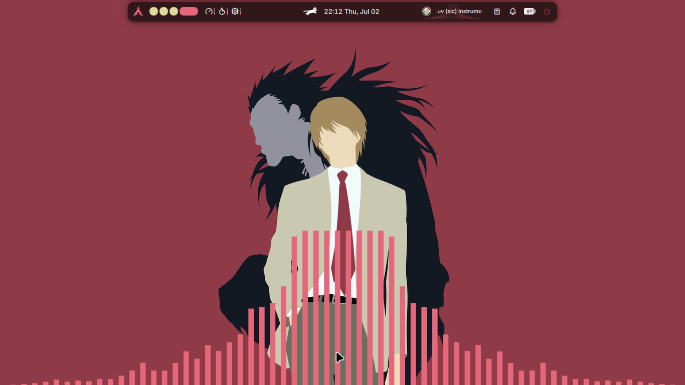
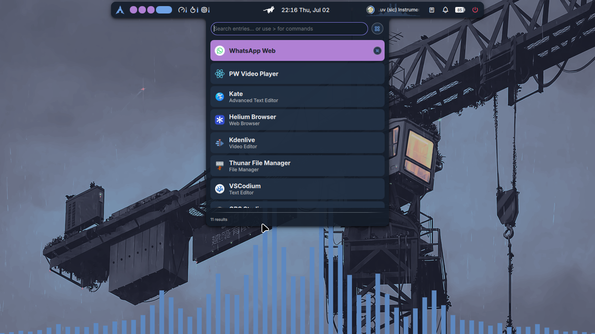
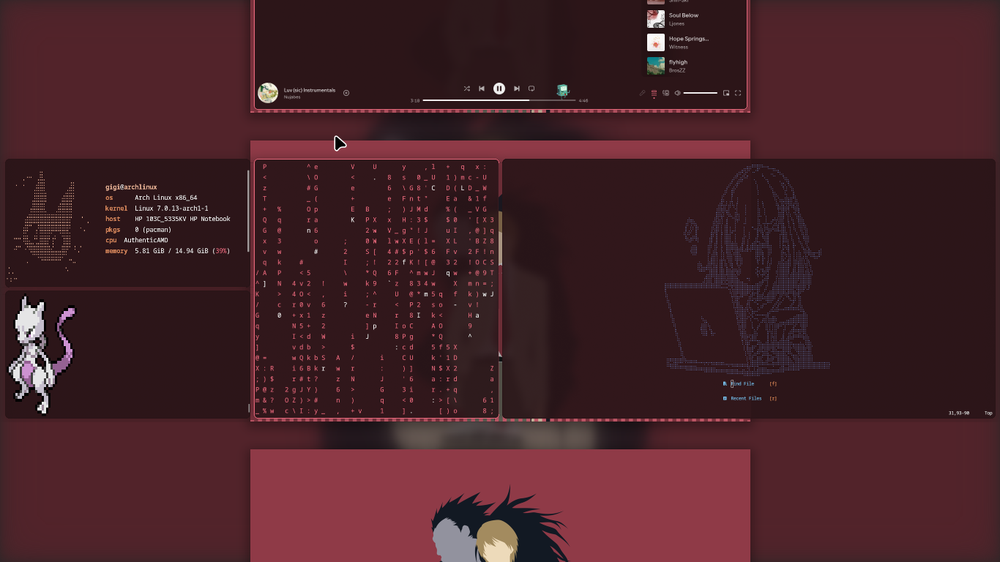
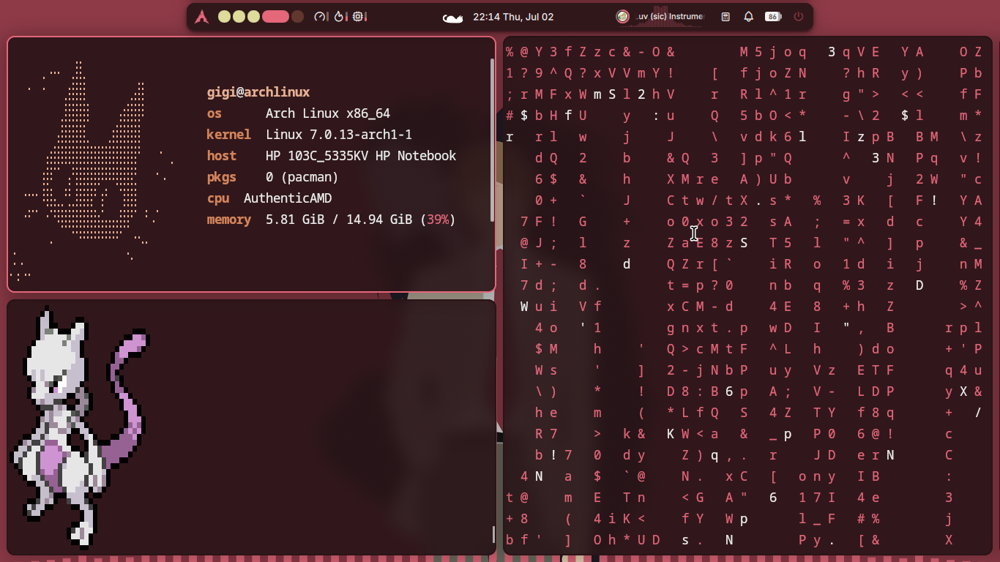
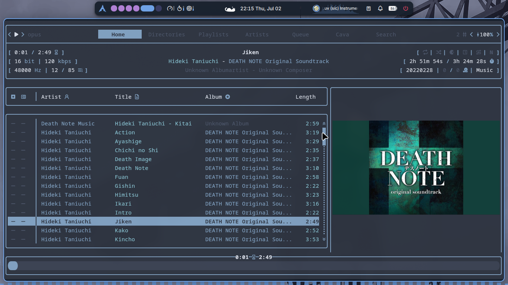

<div align="center">

# 🌿 Gigi's Rice

A modern, minimal and smooth **Niri + Noctalia** desktop rice for **Arch Linux**.




</div>

---

# ✨ Overview

This repository contains the exact configuration used in my Niri showcase video.

The goal of this setup is to create a desktop that feels:

- 🌿 Minimal
- ⚡ Smooth
- 🎨 Modern
- ⌨️ Keyboard Driven
- ❤️ Comfortable for Daily Use

Every configuration included here is the one I personally use.

---

# ⚠️ Important

> [!IMPORTANT]
> **This rice was built and tested with Noctalia v4.7.7.**
>
> It may **not work correctly with Noctalia v5 or newer**.
>
> This rice depends on **Noctalia plugins**, and plugin support is currently unavailable in the latest v5 release. Because of this, the repository currently targets the latest stable v4 release.
>
> Once plugin support is available in v5, this repository will be updated accordingly.

---

# 🖼 Showcase

<details>
<summary>🖥 Desktop</summary>


</details>

<details>
<summary>🚀 Launcher</summary>



</details>

<details>
<summary>📂 Niri Overview</summary>



</details>

<details>
<summary>💻 Terminal Setup</summary>



</details>

<details>
<summary>🎵 rmpc</summary>



</details>

---

# 🛠 Software Used

| Component      | Software   |
| -------------- | ---------- |
| Window Manager | Niri       |
| Shell          | Noctalia   |
| Terminal       | Kitty      |
| Editor         | Neovim     |
| Music          | MPD + rmpc |
| File Manager   | Yazi       |
| Media Player   | MPV        |
| System Info    | Fastfetch  |

---

# 📦 Installation

## 📋 Prerequisites

Before installing this rice, make sure you have:

- An **Arch Linux** based system
- **Niri** installed
- It is recommended to have the **Default Applications** installed beforehand (the script installs them too)

---

## 🚀 Automatic Installation (Recommended)

Clone the repository:

```bash
git clone https://github.com/deadduck-09/gigis-rice.git
cd gigis-rice
```

Make the installer executable:

```bash
chmod +x install.sh
```

Run the installer:

```bash
./install.sh
```

Log out using:

```text
Ctrl+Alt+Delete
```

### Installer Features

- 📦 Automatically installs missing packages
- 🧩 Supports both official repositories and AUR (`yay` / `paru`)
- 💾 Creates backups of existing configurations
- 🔄 Restore backups directly through the installer

---

## 🛠 Manual Installation

If you prefer installing everything manually, copy the desired configuration folders into your `~/.config` directory.

Example:

```bash
cp -r configs/niri ~/.config/
cp -r configs/kitty ~/.config/
cp -r configs/noctalia ~/.config/
```

Copy the wallpapers:

```bash
mkdir -p ~/Pictures/Wallpapers
cp wallpapers/* ~/Pictures/Wallpapers/
```

Repeat for any remaining configuration folders as needed.

---

# ⌨️ Keybindings

<details>
<summary><strong>View Default Keybindings</strong></summary>

<br>

### 🖥 Noctalia

| Shortcut                          | Action                    |
| --------------------------------- | ------------------------- |
| <kbd>Super</kbd> + <kbd>L</kbd>   | Lock Screen               |
| <kbd>Super</kbd> + <kbd>,</kbd>   | Toggle Wallpaper Picker   |
| <kbd>Super</kbd> + <kbd>.</kbd>   | Open Emoji Picker         |
| <kbd>Super</kbd> + <kbd>V</kbd>   | Open Clipboard History    |
| <kbd>Super</kbd> + <kbd>D</kbd>   | Toggle Control Center     |
| <kbd>Alt</kbd> + <kbd>Space</kbd> | Open Application Launcher |

---

### 🚀 Applications

| Shortcut                        | Action               |
| ------------------------------- | -------------------- |
| <kbd>Super</kbd> + <kbd>T</kbd> | Open Kitty           |
| <kbd>Super</kbd> + <kbd>B</kbd> | Open Browser         |
| <kbd>Super</kbd> + <kbd>E</kbd> | Open File Manager    |
| <kbd>Super</kbd> + <kbd>M</kbd> | Open Music Player    |
| <kbd>Super</kbd> + <kbd>O</kbd> | Open Note Taking app |
| <kbd>Super</kbd> + <kbd>C</kbd> | Open CodeEditor      |

</details>

---

# 📌 Default Applications

<details>
<summary><strong>View Default Applications</strong></summary>

<br>

These are the applications configured by default in this rice.
All keybinds will open this if not changed.

| Category        | Application    |
| --------------- | -------------- |
| 🌐 Browser      | Helium Browser |
| 💻 Terminal     | Kitty          |
| 📝 Code Editor  | VSCodium       |
| 📖 Notes        | Obsidian       |
| 📂 File Manager | Thunar         |
| 🎵 Music        | Spotify        |

</details>

---

# 🌄 Wallpapers

The wallpapers featured in the showcase are included in the **wallpapers** folder.

For my complete wallpaper collection, visit:

➡️ **https://github.com/deadduck-09/FireWalls.git**

---

## 🖥 Full System Installation (Optional)

Starting with a fresh Arch Linux installation?

A complete plug-and-play installer is also available. It installs the required packages, configures services, deploys the rice, and prepares the system so you can start using it immediately.

Run:

```bash
curl -fsSL https://raw.githubusercontent.com/deadduck-09/gigis-rice/main/fullsetup-install.sh | bash
```

### What it does

- 📦 Installs all required packages
- 🧩 Installs AUR dependencies
- ⚙️ Enables required services
- 🖼 Installs wallpapers
- 🚀 Provides a ready-to-use desktop after installation

> [!TIP]
> This installer is intended for **fresh Arch Linux installations**. If you already have Niri and Noctalia set up, the standard `install.sh` installer above is the recommended option.

# 📂 Repository Structure

```text
.
├── configs
│   ├── fastfetch
│   ├── fish
│   ├── kitty
│   ├── mpd
│   ├── mpv
│   ├── niri
│   ├── noctalia
│   ├── nvim
│   ├── rmpc
│   ├── starship.toml
│   └── yazi
├── home
├── install.sh
├── LICENSE
├── README.md
├── screenshots
│   ├── Desktop.png
│   ├── launcher.png
│   ├── niri-overview.png
│   ├── rmpc.png
│   └── terminals.png
└── wallpapers
    ├── crane.png
    ├── deathnote.jpg
    └── Violet-Evergarden.png
```

---

# ❤️ Credits

A huge thank you to the developers behind these amazing open-source projects.

- **[Niri](https://github.com/YaLTeR/niri)**
- **[Noctalia](https://github.com/NoctaliaDev/noctalia-shell)**
- **[Kitty](https://sw.kovidgoyal.net/kitty/)**
- **[Neovim](https://github.com/neovim/neovim)**
- **[MPD](https://github.com/MusicPlayerDaemon/MPD)**
- **[rmpc](https://github.com/mierak/rmpc)**
- **[Fastfetch](https://github.com/fastfetch-cli/fastfetch)**
- **[Yazi](https://github.com/sxyazi/yazi)**
- **[MPV](https://github.com/mpv-player/mpv)**

Without these incredible projects, this setup wouldn't exist.

---

# ⭐ Support

If you like this setup:

- ⭐ Star the repository
- 🍴 Fork it
- **[🎥 Watch the showcase](https://youtu.be/RwgF075vDU4?si=8AI1kE-NgDcpLYtx)**
- 💙 Use any part of the configuration you like.

---

> _"My desktop may be minimal, but the time spent configuring it definitely wasn't."_ 😭
